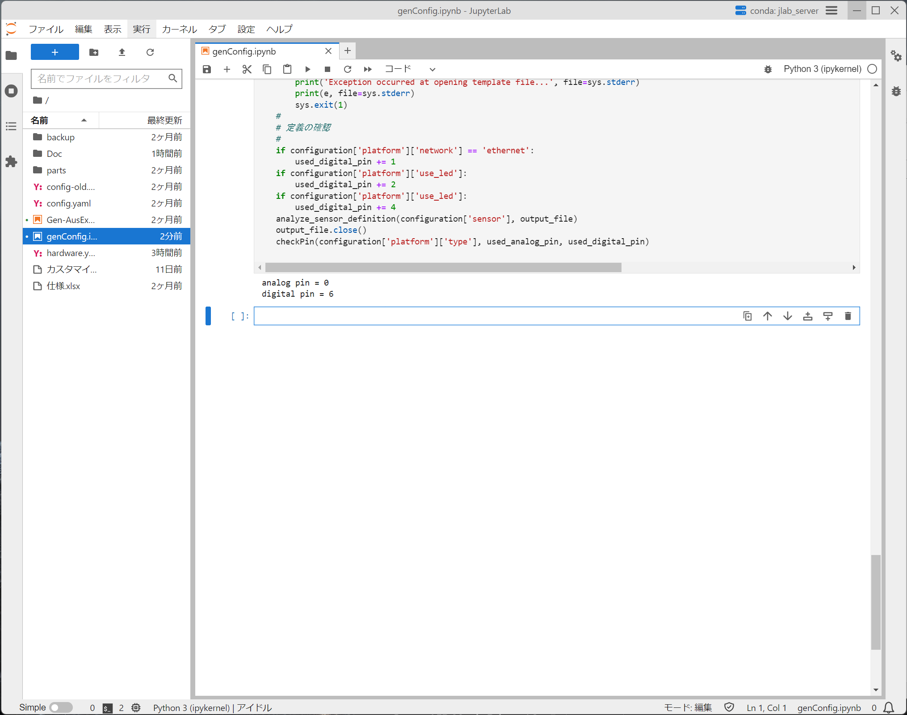
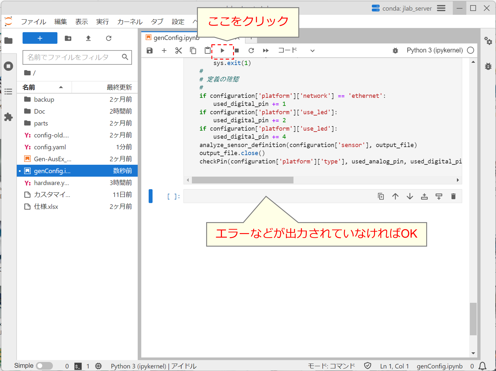

# ハードウェアの定義
Arduino用プログラムの生成は以下の2つのステップで行う．

- センサ端末のハードウェアを記述した定義ファイルから，センサ端末の詳細な定義ファイルのテンプレートを出力
- 出力されたテンプレートを編集して，センサ端末の詳細な定義を作り，この定義からセンサ端末のプログラムを生成

最初に，ハードウェアの定義ファイルを作成する．

## ハードウェア用定義ファイルの作成
ハードウェアの定義ファイルは以下の内容をhardware.yamlという名前で保存する．
```
platform:
  type: mkr # classic , mega , nano , mkr , none
  network: wifi # wifi , ethernet 
  rtc: PCF8523 # RTC8564NB , DS1307 , DS3231 , PCF8523 , RV8803 , RX8025 , RX8900 , none
  use_led: true # true(使う) , false(使わない)
  use_sd: true # true(使う) , false(使わない)

sensor:
  # I2C
  #sht31: true # true(使う) , false(使わない)
  #sht2x: true # true(使う) , false(使わない)
  #am232x: true # true(使う) , false(使わない)
  #bme280: true # true(使う) , false(使わない)
  #bmp180: true # true(使う) , false(使わない)
  #adxl345: true # true(使う) , false(使わない)
  #mma7660: true # true(使う) , false(使わない)
  #itg320: true # true(使う) , false(使わない)
  #groveI2C_Touch: true # true(使う) , false(使わない)
  #tcs34725: true # true(使う) , false(使わない)
  #tsl2561: true # true(使う) , false(使わない)
  # digital
  #dht: true # true(使う) , false(使わない)
  #digitalSwitch: true # true(使う) , false(使わない)
  #groveTouch: true # true(使う) , false(使わない)
  #waterDetection: true # true(使う) , false(使わない)
  #groveLineFinder: true # true(使う) , false(使わない)
  #groveDistanceInterrupter: true # true(使う) , false(使わない)
  #groveIrRefrect: true # true(使う) , false(使わない)
  #grovePIR: true # true(使う) , false(使わない)
  # analog
  #adxl335: true # true(使う) , false(使わない)
  #murataENC03: true # true(使う) , false(使わない)
  #analogTemperature: true # true(使う) , false(使わない)
  #analogRotalyAngle: true # true(使う) , false(使わない)
  #groveAnalogLight: true # true(使う) , false(使わない)
  #groveAnalogSound: true # true(使う) , false(使わない)
  #groveAnalogMoisture: true # true(使う) , false(使わない)
  #groveGSR: true # true(使う) , false(使わない)
  #groveCurrent: true # true(使う) , false(使わない)
```


## 基本システムの定義内容
基本システムの定義部分は以下のようなものになっている．
```
platform:
  type: mkr # classic , mega , nano , mkr , none
  network: wifi # wifi , ethernet , none
  rtc: PCF8523 # RTC8564NB , DS1307 , DS3231 , PCF8523 , RV8803 , RX8025 , RX8900 , none
  use_led: true # true(使う) , false(使わない)
  use_sd: true # true(使う) , false(使わない)
```
定義の各項目について説明する．

### ``type``
ここは，仕様するArduinoのファミリが何であるかを定義する項目である．
基本システムを構成するArduinoがどのファミリに分類されるかは，[公式サイトのハードウェアページ](https://www.arduino.cc/en/hardware)を参照して
いただきたい．

この定義はGroveシールドを使う場合のコネクタ数等を数えることを想定しているが，現在未実装であるため，``none``にしてもかまわない．

### ``network``

ここの定義は，基本システムが備えているネットワークが有線イーサネットかWiFiかを選択する．


### ``rtc``
基本システムに接続しているRTCのICの種別を選択する．
上の例では，「NXP Semiconductors」の「PCF8523」を使うことを指示している．


### ``use_led``
基本システムに[LED](https://wiki.seeedstudio.com/Grove-Chainable_RGB_LED/)を採用しているか否かを記載する．
採用している場合は``true``，そうでなければ``false``を記入する．


### ``use_sd``
基本システムにマイクロSDスロットが存在するか否かを記載する．
マイクロSDスロットがある場合は``true``，そうでなければ``false``を記入する．


## センサの定義
センサ定義部分の例を下に示す．下の例では，大量にコメントアウトされている行があるが，これらの行は無視されるため，利用するセンサのみコメントを外し，``true``と定義する．

```
sensor:
  # I2C
  sht31: true # true(使う) , false(使わない)
  sht2x: false # true(使う) , false(使わない)
  #am232x: true # true(使う) , false(使わない)
  bme280: true # true(使う) , false(使わない)
  #bmp180: true # true(使う) , false(使わない)
  #adxl345: true # true(使う) , false(使わない)
  #mma7660: true # true(使う) , false(使わない)
  #itg320: true # true(使う) , false(使わない)
  #groveI2C_Touch: true # true(使う) , false(使わない)
  #tcs34725: true # true(使う) , false(使わない)
  #tsl2561: true # true(使う) , false(使わない)
  # digital
  #dht: true # true(使う) , false(使わない)
  #digitalSwitch: true # true(使う) , false(使わない)
  #groveTouch: true # true(使う) , false(使わない)
  #waterDetection: true # true(使う) , false(使わない)
  #groveLineFinder: true # true(使う) , false(使わない)
  #groveDistanceInterrupter: true # true(使う) , false(使わない)
  #groveIrRefrect: true # true(使う) , false(使わない)
  #grovePIR: true # true(使う) , false(使わない)
  # analog
  #adxl335: true # true(使う) , false(使わない)
  #murataENC03: true # true(使う) , false(使わない)
  #analogTemperature: true # true(使う) , false(使わない)
  #analogRotalyAngle: true # true(使う) , false(使わない)
  #groveAnalogLight: true # true(使う) , false(使わない)
  #groveAnalogSound: true # true(使う) , false(使わない)
  #groveAnalogMoisture: true # true(使う) , false(使わない)
  #groveGSR: true # true(使う) , false(使わない)
  #groveCurrent: true # true(使う) , false(使わない)
```

下は，上の例から，コメントアウトされていない行だけを抜き出したものである．
この例では，SHT31とBME280の2つがセンサ端末に接続されていると見なし，SHT2Xは``false``であるため，繋がっていないと見なされる．
```
sensor:
  sht31: true # true(使う) , false(使わない)
  sht2x: false # true(使う) , false(使わない)
  bme280: true # true(使う) , false(使わない)
```

## センサ端末の詳細定義ファイルの生成
詳細定義ファイルを生成するプログラムは，「genConfig.ipynb」ファイルである．
作成したハードウェア定義ファイル(hardware.yaml)を「genConfig.ipynb」と同じディレクトリにコピーした上で，
「genConfig.ipynb」を起動する．



下図のように，黒三角をクリックし，末尾にエラーなどが表示されていなければ成功です．
同じディレクトリに「config.yaml」ができているはずです．(もし存在していれば，置き換わっている．)



***
- [「センサ端末の詳細定義」に進む](TotalDefinition.md)
- [「README」に戻る](../README.md)

