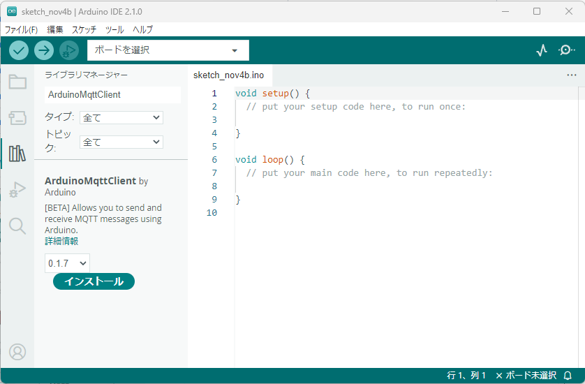
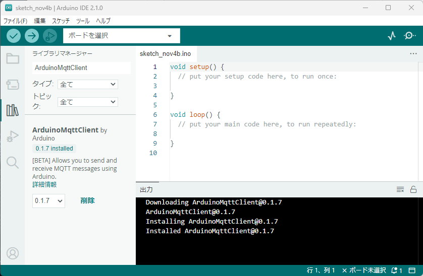
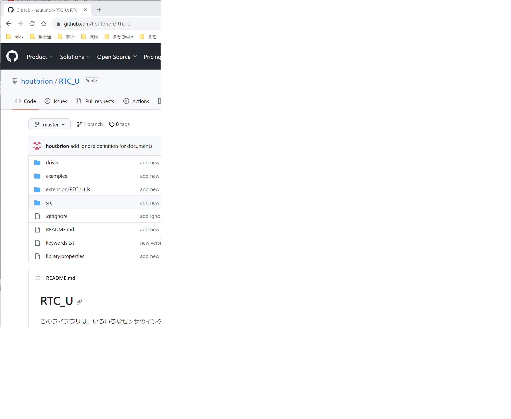
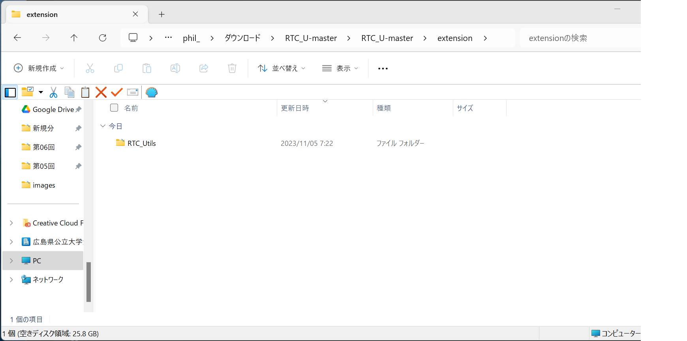

# Arduino IDEのライブラリの準備

## インストールする必要があるライブラリ

### ライブラリマネージャでインストールするライブラリ

| ライブラリ名| ライブラリの種類(機能) |
|---|---|
| [ArduinoMqttClient](https://www.arduino.cc/reference/en/libraries/arduinomqttclient/) | MQTTクライアント用ライブラリ |
| [Adafruit_SleepyDog](https://www.arduino.cc/reference/en/libraries/adafruit-sleepydog-library/) | WDT用ライブラリ |
| [Grove_Chainable_RGB_LED](https://www.arduino.cc/reference/en/libraries/grove-chainable-rgb-led/) | フルカラーLED用ライブラリ |
| [WiFiNINA](https://www.arduino.cc/reference/en/libraries/wifinina/) | 一部機種用WiFiチップ用ライブラリ |
| [NTPClient](https://www.arduino.cc/reference/en/libraries/ntpclient/) | NTP用ライブラリ |
| [ArduinoHttpClient](https://www.arduino.cc/reference/en/libraries/arduinohttpclient/) | HTTPライブラリ |
| [ArduinoLowPower](https://www.arduino.cc/reference/en/libraries/arduino-low-power/) | 省電力用ライブラリ |
| [RTCZero](https://www.arduino.cc/reference/en/libraries/rtczero/) | RTC関連ライブラリ |

### 手動でインストールする必要があるライブラリ

|ライブラリ配布元 | ライブラリの種類(機能) |
|---|---|
| https://github.com/houtbrion/RTC_U | RTC用ライブラリ |
| https://github.com/houtbrion/Syslog | syslog用ライブラリ |
| https://github.com/houtbrion/UniSleep | 省電力用機能 |
| https://github.com/houtbrion/detectArduinoHardware | 複数機種の差分を吸収するライブラリ |
| https://github.com/houtbrion/dateUtils | 時刻関連機能 |
| https://github.com/houtbrion/AusEx | センサライブラリ |


## ライブラリマネージャを使うライブラリのインストール方法
下の図は，「ArduinoMqttClient」をインストールした直前の画面である．

最初にライブラリマネージャを開き，検索窓にライブラリ名を入力すると，ライブラリ名が似たものが下に一覧表示される．

この中から，適切な物を選択し，「インストール」ボタンを押すとインストールが実行される．


下の図はインストール直後の画面である．
インストール操作のメッセージが出力され，ライブラリマネージャ側には，インストールされたバージョン等が表示される．


以上のような手順で，ライブラリマネージャでインストールすべきライブラリを全てインストールすること．

## RTC_Uのインストール

### ライブラリのダウンロードと本体部分のインストール
githubの[ここ](https://github.com/houtbrion/RTC_U)をブラウザで開き，「Code」ボタンを押し，
「Download Zip」をクリックする(下図)．



ダウンロードディレクトリにZipアーカイブが格納されるため，zipを解凍(下図)．

.png)

解凍したディレクトリに移動すると，同じ名前のディレクトリができている．


このディレクトリをそのまま(もしくは名前を変更)して，Arduino IDEのライブラリ置き場にコピーした後に，コピー元ディレクトリ内に移動．


このディレクトリの「extension」ディレクトリに移動(下図)すると，「RTC_Utils」というディレクトリがあるので，
これをArduinoのライブラリ置き場にコピーする．




### 個別RTC用デバイスドライバのインストール
再度，アーカイブを解いたライブラリの大元のディレクトリ(下図)に移動．


ここの「driver」ディレクトリに移動すると，RTCのIC毎にディレクトリが作られているので，
すべてのディレクトリをArduinoのライブラリ置き場にコピーする．


以上でRTC_Uのインストールは完了．


## detectArduinoHardwareのインストール
githubの[ここ](https://github.com/houtbrion/detectArduinoHardware)をブラウザで開き，「Code」ボタンを押し，
「Download Zip」をクリックしてアーカイブをダウンロードする．

アーカイブを解き，ライブラリ本体のディレクトリをArduinoのライブラリ置き場にコピーする．

次に，
「extension」ディレクトリ内部の「arduinoHardwareHelper」と「UniSleep」ディレクトリもArduinoのライブラリ置き場にコピーする．

## dateUtilsのインストール

githubの[ここ](https://github.com/houtbrion/dateUtils)をブラウザで開き，「Code」ボタンを押し，
「Download Zip」をクリックしてアーカイブをダウンロードする．

アーカイブを解き，ライブラリ本体のディレクトリをArduinoのライブラリ置き場にコピーする．

dateUtilsには特別な拡張機能などはないため，これでインストールは終了．

## AusExのインストール
githubの[ここ](https://github.com/houtbrion/AusEx)をブラウザで開き，「Code」ボタンを押し，
「Download Zip」をクリックしてアーカイブをダウンロードする．

アーカイブを解き，ライブラリ本体のディレクトリをArduinoのライブラリ置き場にコピーする．

### pluginのインストール

コピー元のディレクトリ内部を見ると，pluginディレクトリがある．
この「plugin」ディレクトリ内部の「AusExOutputPlugin」ディレクトリをArduinoのライブラリ置き場にコピーする．

### 個別デバイス用ドライバのインストール

コピー元のディレクトリ内部を再度見ると，driversディレクトリがある．
この「drivers」ディレクトリを開くと「I2C_SPI」など，Arduinoの周辺回路の
接続インターフェース毎にディレクトリ分けされている．

「I2C_SPI」に移動すると，「AusExADXL345」等センサデバイス用のライブラリが収容されている．

これらのディレクトリを丸ごとライブラリ置き場にコピーすれば良い．

Arduino IDEはライブラリがあるディレクトリの中はすべてのライブラリがフラットに並んでいることを想定しているため，
何らかの基準でディレクトリに分けて，個々のライブラリがサブディレクトリとして格納されていた場合，IDEが
ライブラリを認識しないため，コピーする際には注意が必要．

## Syslogのインストール


githubの[ここ](https://github.com/houtbrion/Syslog)をブラウザで開き，「Code」ボタンを押し，
「Download Zip」をクリックしてアーカイブをダウンロードする．

アーカイブを解き，ライブラリ本体のディレクトリをArduinoのライブラリ置き場にコピーする．


Syslogはすべての機能を同時に有効にすると，Arduinoのスケッチ(プログラム)のサイズが極端に大きくなることと，
実装している機能には，相互に有効にすると問題が発生するものがあるため，srcディレクトリの「config.h」を
編集する必要がある．以下はデフォルトの設定である．
```
#define USE_NETWORK
#define USE_FILE
#define USE_HARDWARE_SERIAL
//#define USE_SOFTWARE_SERIAL

#define OUTPUT_TIME
//#define USE_RTC
//#define USE_NTP
```

今回の対象となるIoTのセンサ端末では，ログの出力先はシリアルかファイル(もしくは両方)に限定されることと，
RTCを使うことを前提としているため，以下のような設定に変更する．

```

#define USE_FILE
#define USE_HARDWARE_SERIAL
//#define USE_SOFTWARE_SERIAL

#define OUTPUT_TIME
#define USE_RTC
```

シリアルに関しては，利用するArduinoの機種のUSB端子(もしくはシリアル端子)がUSE_SOFTWARE_SERIAL
の場合のみ，以下のように変更する．
```
//#define USE_HARDWARE_SERIAL
#define USE_SOFTWARE_SERIAL
```

基本的に，Arduino公式が販売しているハードウェアでは，プログラムに使うポート(通常USB)は
ハードウェアシリアルになっているが，既に，生産中止になった過去の機種の中には，
ソフトウェアシリアルを用いる必要なものが存在した．

他にも，ログを出力する機器自体が他の計算機の周辺機器として動作する場合のように，
ログの出力先にプログラム用のUSBを使わずに，別のデジタル端子経由で接続する
ことが考えられるため，このような場合にソフトウェアシリアルを使う機能を
有効にする．


また，RTCを使わずにNTPで時刻を問い合わせる等の場合はそれに合わせて定義を
カスタマイズする．

***
- [「Arduinoのプログラム(スケッチ)のインストール」に進む](スケッチのコンパイルとインストール.md)
- [「Arduino IDEのインストール」に戻る](ArduinoIDEインストール.md)
- [「README」に戻る](../README.md)
