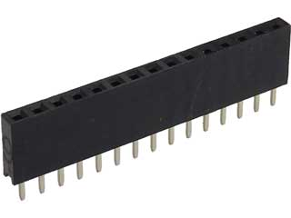

# 基本システム組み立て
動作の確認が取れているArduinoの機種を使った推奨の構成を組み立てる方法を説明する．
なお，マイクロSD, LEDとRTCは用途によっては不要であるが，ここでは使うものとする．また，RTCはDS3231を例にとって説明する．

## 1. MKR Zero + MKR Ethernetシールド

### 1.1. パーツリスト

- [Arduino MKR ZERO](https://store-usa.arduino.cc/products/arduino-mkr-zero-i2s-bus-sd-for-sound-music-digital-audio-data)

- [Arduino MKR ETH Shield](https://store-usa.arduino.cc/products/arduino-mkr-eth-shield)

- [Arduino MKR Connector Carrier](https://store-usa.arduino.cc/products/arduino-mkr-connector-carrier-grove-compatible)

- マイクロSDメディア

- [Grove – Chainable RGB LED](https://www.seeedstudio.com/Grove-Chainable-RGB-Led-V2-0.html)

- [Grove - 4 pin Male Jumper](https://www.seeedstudio.com/Grove-4-pin-Male-Jumper-to-Grove-4-pin-Conversion-Cable-5-PCs-per-Pack.html)

- [Adafruit DS3231 Precision RTC Breakout](https://www.adafruit.com/product/3013)

- [Grove - 4 pin Female Jumper to Grove 4 pin Conversion Cable](https://www.seeedstudio.com/Grove-4-pin-Female-Jumper-to-Grove-4-pin-Conversion-Cable-5-PCs-per-PAck.html)

- [Grove - I2C Hub](https://www.seeedstudio.com/Grove-I2C-Hub.html)

### 1.2. 組み立て

本体とGrove対応基板，イーサネットシールドを下図のように組み立てる．この時，青い大きな端子(ターミナルブロック)とはUSBやイーサネットのコネクタが反対になるように組み上げる．

さらに，マイクロSDは本体側のスロットに挿入する．イーサネットシールドにもマイクロSDのスロットは存在するが，本体側が優先されるため，イーサネットシールド側にマイクロSDを挿入しても，認識されない．

LEDはデジタル端子2つが1つのGroveコネクタに配線されている必要があるため，下図の「A5A6」もしくは「D5D6」コネクタのどちらかに接続する必要がある．
また，Arduinoの仕様上アナログ端子はデジタル端子として利用可能なため，「A5A6」への接続を想定してしまうが，Arduino MKR Connector Carrierの
回路の配線の都合上，アナログ端子をデジタル端子として利用できない．

そのため，この[ケーブル](https://www.seeedstudio.com/Grove-4-pin-Male-Jumper-to-Grove-4-pin-Conversion-Cable-5-PCs-per-Pack.html)を使って
配線する必要があるが，Groveのコネクタへの配線，I2CやSPIのピン配置を考えると，「D6,D7」に接続するのが望ましい．
「D6」に白ケーブル,「D7」に黄色ケーブル,「GND」に黒ケーブル「VCC」に赤ケーブルを接続する．

RTCはI2C接続であるため，下図の「TWI」端子に接続する必要がある．

ただし，コネクタが1つしか存在しないため，I2Cのセンサ等を後に接続する可能性があるため，I2C HUBを基板のTWIに接続し，I2C HUBにRTCを繋ぐ．

RTC(DS3231)の配線は，VIN端子に赤色，GND端子に黒色，SCL端子に黄色，SDA端子に白色端子を接続する．

## 2. MKR WiFi1010 + マイクロSDシールド

### 2.1. パーツリスト
- [Arduino MKR WiFi 1010](https://store-usa.arduino.cc/products/arduino-mkr-wifi-1010)

- [Arduino MKR Connector Carrier](https://store-usa.arduino.cc/products/arduino-mkr-connector-carrier-grove-compatible)

- マイクロSDメディア

- [MKR SD Proto Shield](https://store-usa.arduino.cc/products/mkr-sd-proto-shield)

- [Grove – Chainable RGB LED](https://www.seeedstudio.com/Grove-Chainable-RGB-Led-V2-0.html)

- [Adafruit DS3231 Precision RTC Breakout](https://www.adafruit.com/product/3013)

- [Grove - 4 pin Female Jumper to Grove 4 pin Conversion Cable](https://www.seeedstudio.com/Grove-4-pin-Female-Jumper-to-Grove-4-pin-Conversion-Cable-5-PCs-per-PAck.html)

- [Grove - I2C Hub](https://www.seeedstudio.com/Grove-I2C-Hub.html)

### 2.2. 組み立て

本体とGrove対応基板，イーサネットシールドを下図のように組み立てる．この時，青い大きな端子(ターミナルブロック)とはUSBやイーサネットのコネクタが反対になるように組み上げる．

さらに，マイクロSDは本体側のスロットに挿入する．イーサネットシールドにもマイクロSDのスロットは存在するが，本体側が優先されるため，イーサネットシールド側にマイクロSDを挿入しても，認識されない．

Arduinoのアナログ端子はデジタル端子としても利用できるが，
Arduino MKR Connector Carrierのアナログ端子の配線の関係で，「A5A6」コネクタをデジタル端子として利用することが
できないため，D5D6端子に接続する必要がある．

RTCはI2C接続であるため，下図の「TWI」端子に接続する必要がある．

ただし，コネクタが1つしか存在しないため，I2Cのセンサ等を後に接続する可能性があるため，I2C HUBを基板のTWIに接続し，I2C HUBにRTCを繋ぐ．

RTC(DS3231)の配線は，VIN端子に赤色，GND端子に黒色，SCL端子に黄色，SDA端子に白色端子を接続する．

## 3. Arduino Uno R4 Minima + Ethernetシールド

### 3.1. パーツリスト
- [Arduino UNO R4 Minima](https://store-usa.arduino.cc/products/uno-r4-minima)

- [Arduino Ethernet Shield 2](https://store-usa.arduino.cc/products/arduino-ethernet-shield-2)

- [Arduino用 Groveベースシールド](https://jp.seeedstudio.com/Base-Shield-V2.html)

- マイクロSDメディア

- [Grove – Chainable RGB LED](https://www.seeedstudio.com/Grove-Chainable-RGB-Led-V2-0.html)

- [Adafruit DS3231 Precision RTC Breakout](https://www.adafruit.com/product/3013)

- [Grove - 4 pin Female Jumper to Grove 4 pin Conversion Cable](https://www.seeedstudio.com/Grove-4-pin-Female-Jumper-to-Grove-4-pin-Conversion-Cable-5-PCs-per-PAck.html)

### 3.2. 組み立て

イーサネットシールドの背が高いため，積み重ねる際には，本体，Groveシールド，イーサネットシールドの順で重ねる必要がある．

そのため，本体とシールドを重ねてしまうと，Groveを使った周辺回路の組み立てができなくなるため，先に，周辺回路を組み立てる．

イーサネットシールドに，マイクロSDを挿入する．

GroveシールドのI2CコネクタにRTCを，デジタル端子にLEDを接続するが，後で接続するモジュール(回路)が増える可能性もあるので，シール基板の中央付近のコネクタを選択している．下図では，LEDはGrove D2コネクタ(D2端子とD3端子の2個組)を利用しているが，どのコネクタを用いても良い．推奨は，Uno R4 Wifiと同じD6コネクタ(D6とD7の組み合わせ)である．

最後に，本体と重ねて組み上げれば終了である．

RTC(DS3231)の配線は，VIN端子に赤色，GND端子に黒色，SCL端子に黄色，SDA端子に白色端子を接続する．

## 4. Arduino Uno R4 WiFi + マイクロSDシールド
### 4.1. パーツリスト

- [Arduino UNO R4 WiFi](https://store-usa.arduino.cc/products/uno-r4-wifi)

- [Arduino用 Groveベースシールド](https://jp.seeedstudio.com/Base-Shield-V2.html)

- [SD Card Shield](https://www.seeedstudio.com/SD-Card-Shield-V4-p-1381.html)

- [SparkFun microSD Shield](https://www.sparkfun.com/products/12761)

- マイクロSDメディア

- [Grove – Chainable RGB LED](https://www.seeedstudio.com/Grove-Chainable-RGB-Led-V2-0.html)

- [Adafruit DS3231 Precision RTC Breakout](https://www.adafruit.com/product/3013)

- [Grove - 4 pin Female Jumper to Grove 4 pin Conversion Cable](https://www.seeedstudio.com/Grove-4-pin-Female-Jumper-to-Grove-4-pin-Conversion-Cable-5-PCs-per-PAck.html)

### 4.2. 組み立て

下の手順は，[SDシールド](https://www.seeedstudio.com/SD-Card-Shield-V4-p-1381.html)ではなく，[マイクロSDシールド](https://www.sparkfun.com/products/12761)を
用いたものであるが，手順は同じである．

まずはじめに，マイクロSDのシールドにメディアを挿しておく．

マイクロSDのシールドは基板面に触ることがないので，本体とGroveのシールドで挟む形で組み立てる．

RTC(DS3231)の配線は，VIN端子に赤色，GND端子に黒色，SCL端子に黄色，SDA端子に白色端子を接続する．

最後に，RTCをGroveのI2C端子のいずれかに，また，LEDはGroveのD6コネクタ(D6ピンとD7ピンを使うもの)に挿す．

## 5. Arduino Nano 33 IoT
### 5.1. パーツリスト

- [Arduino Nano 33 IoT](https://store-usa.arduino.cc/products/arduino-nano-33-iot)

- [Grove Shield for Arduino Nano](https://www.seeedstudio.com/Grove-Shield-for-Arduino-Nano-p-4112.html)

- [ピンソケット](https://akizukidenshi.com/catalog/g/gC-10102/)

- [マイクロSDモジュール](https://www.adafruit.com/product/254)

- ジャンパーワイヤ
|ケーブル色|販売元URL|
|---|---|
| 黒 | https://akizukidenshi.com/catalog/g/gC-08932/ |
| 赤 | https://akizukidenshi.com/catalog/g/gC-08933/ |
| 黄 | https://akizukidenshi.com/catalog/g/gC-08936/ |
| 青 | https://akizukidenshi.com/catalog/g/gC-08934/ |
| 白 | https://akizukidenshi.com/catalog/g/gC-08935/ |

- マイクロSDメディア

- [Grove – Chainable RGB LED](https://www.seeedstudio.com/Grove-Chainable-RGB-Led-V2-0.html)

- [Adafruit DS3231 Precision RTC Breakout](https://www.adafruit.com/product/3013)

- [Grove - 4 pin Female Jumper to Grove 4 pin Conversion Cable](https://www.seeedstudio.com/Grove-4-pin-Female-Jumper-to-Grove-4-pin-Conversion-Cable-5-PCs-per-PAck.html)

- [Grove - I2C Hub](https://www.seeedstudio.com/Grove-I2C-Hub.html)

### 5.2. 組み立て

Arduino Nano 33 IoTの各ピンがどのような機能の端子に対応しているかを示す図が公式サイトの
[ここ](https://content.arduino.cc/assets/Pinout-NANO33IoT_latest.pdf)に記載されている．

上の図の中で，SPIに関係する端子は下図の赤点線で囲まれている端子(D11, D12, D13)となる．

また，マイクロSDモジュールのピンは以下の図の通り．

マイクロSDはSPI接続となるため，[マイクロSDモジュール](https://www.adafruit.com/product/254)の各端子とNano 33 IoTとの
ピンの対応関係は以下の表のようになる．

|SPI|Groveシールド端子|マイクロSDモジュール|
|---|---|---|
|電源|3V3|3V|
|GND|GND|GND|
|SCK(クロック)|D13|CLK|
|MISO|D12|DO|
|MOSI|D11|DI|
|チップセレクト|D10|CS|

チップセレクトは特に縛りは無いが，Arduinoの従来のシールドでチップセレクトとして良く使われる端子である上，Nano用Groveシールドで
Grove用のコネクタに割り当てられていないため，これを用いるのが望ましい．

また，Nano用Groveシールドにピンをはんだ付けし，Nanoを挿入すると端子番号はほぼ読めなくなるため，下に拡大図を示す．

実際に配線すると以下のようになる．

次に，LEDとRTC等のI2C機器の接続であるが，LEDは特に規制は無いが，既に使われている比率が高い数字の大きい方から選択し，D6コネクタ(D6とD7端子)とし，
I2Cは該当のコネクタがGroveシールド上にあるため，それを使う．

また，RTC(DS3231)の配線は，VIN端子に赤色，GND端子に黒色，SCL端子に黄色，SDA端子に白色端子を接続する．

全て配線すると以下の図のようになる．

<!-- コメントアウトしたい内容 -->
<!-- 

## Arduino Nano ESP32

### パーツリスト

Arduino Nano ESP32

https://store-usa.arduino.cc/products/nano-esp32

Grove Shield for Arduino Nano

https://www.seeedstudio.com/Grove-Shield-for-Arduino-Nano-p-4112.html

ピンソケット

https://akizukidenshi.com/catalog/g/gC-10102/

マイクロSDモジュール

https://www.adafruit.com/product/254

- ジャンパーワイヤ
|ケーブル色|販売元URL|
|---|---|
| 黒 | https://akizukidenshi.com/catalog/g/gC-08932/ |
| 赤 | https://akizukidenshi.com/catalog/g/gC-08933/ |
| 黄 | https://akizukidenshi.com/catalog/g/gC-08936/ |
| 青 | https://akizukidenshi.com/catalog/g/gC-08934/ |
| 白 | https://akizukidenshi.com/catalog/g/gC-08935/ |

- マイクロSDメディア

- Grove – Chainable RGB LED

https://www.seeedstudio.com/Grove-Chainable-RGB-Led-V2-0.html

- Adafruit DS3231 Precision RTC Breakout

https://www.adafruit.com/product/3013

- Grove - 4 pin Female Jumper to Grove 4 pin Conversion Cable

https://www.seeedstudio.com/Grove-4-pin-Female-Jumper-to-Grove-4-pin-Conversion-Cable-5-PCs-per-PAck.html

- Grove - I2C Hub

https://www.seeedstudio.com/Grove-I2C-Hub.html

-->

***

- [マニュアルトップに戻る](../Manual.md)

