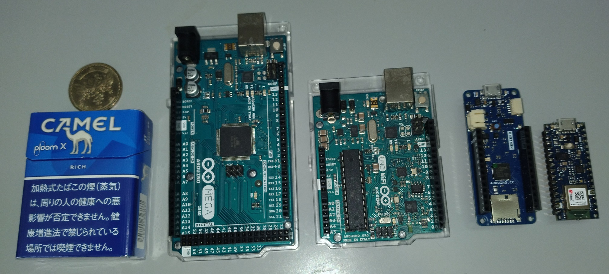
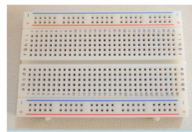

# マイコンとArduinoの概要

マイコンとはマイクロコンピュータとかマイクロコントローラの略語であり，きちんとした定義はないが，イメージとしては，家電製品や自動車，工場のロボット等の制御に用いられるコンピュータで，
搭載されているLSIは通常のPCのCPU(Central Processing Unit)が計算機能だけを搭載しているのに対して，マイコン用のLSIではCPUとしての機能に加えて，メモリも内蔵しており，近年のものは，プログラムを
格納するストレージに相当する回路も同じLSIに内蔵する傾向にある．
また，名称もCPUではなく，MCU (Micro Controller Unit)と呼ばれることが多い．

性能面では，PC等に搭載されるCPUが最小32bit, 最近は64や128bitが多いのに対して，マイコン用のMCUでは，8から32bitの範囲となる．

## 1. Arduinoとは
ワンボードマイコンとは，1枚の基板に必要最小限の回路を全て搭載したマイコンの種類であり，近年はホビー，子供や学生のプログラミング教育，IoT等のシステムの試作段階に用いられている．

[Arduino](https://www.arduino.cc/)は，2005年にイタリアで開始されたプロジェクトの名前であり，統一的な設計思想で開発された多数のワンボードマイコンと，そのマイコンに接続するための周辺回路，および，マイコン用のソフトウェアを開発する開発環境からなっている．

Arduino用ソフトウェア開発環境はArduino IDEといい，Arduino Foundationという非営利団体が管理している．
これに対して，Arduinoに含まれる各種のワンボードマイコンや専用のハードウェアはArduino Holdingという営利組織が開発と販売を行っている．

また，Arduinoの人気向上に伴い，Arduino IDEでソフトウェアの開発が可能な互換マイコンを発売する組織や，Arduinoと接続して使うための周辺機器を販売する企業も多数存在している．

### 1.1. 代表的な機種

Arduino公式のハードウェアは[公式サイト](https://www.arduino.cc/)のHardwareタブをクリックした[先](https://www.arduino.cc/en/hardware)にリストアップされている．

Arduinoの機種はいろいろあるが，大まかに基板のサイズで分類されており，
Nanoファミリ，MKRファミリ，Classicファミリ，Megaファミリに分けられている．
下の写真の右側からNanoファミリ(Nano33BLE)，MKRファミリ(MKR zero)，Classicファミリ(Uno R3), Megaファミリ(Mega2560)の機種である．

参考までにタバコの箱と500円玉を並べてあるので大きさの参考にしていただきたい．

Arduinoの搭載しているMCUは機種(ファミリではない)によって異なり，
プロジェクト開始直後に発売された機種はAtmel社のAVRシリーズのMCU(atmel社独自)を
搭載している．

それに対して，近年発売された大部分の機種(MKRシリーズ)は
Atmel SAMDシリーズ(Armコア)のMCUを採用している．

例外はいくつもあるが，Bluetoothをサポートしている機種(上の写真のNano33BLE)はNordic semiconductor社のMCUを採用しており，Classic シリーズは新しいバージョン(Uno R4)から，ルネサステクノロジのチップ(RA4M1)を，Megaシリーズの最新機種であるArduino GIGA R1 WiFiはSTマイクロ社のarmコアのMCUを内蔵し，ハイスペックな機種となっている．

|機種名|MCU|動作周波数|プログラム容量(flash)|メモリ容量(SRAM)|
|---|---|---|---|---|
|Arduino Nano 33 BLE|nRF52840|64MHz|1MB|256KB|
|MKR ZERO|SAMD21|48MHz|256KB|32KB|
|Uno R3|ATmega328P|16MHz|32KB|2KB|
|Uno R4|RA4M1|48MHz|256KB|32KB|
|Mega2560|ATmega2560|16MHz|256KB|8KB|
|GIGA R1 WiFi|STM32H747XI|480MHz(240MHz)|2MB|1MB|

### 1.2. 互換機
Arduinoのソフトウェア開発環境であるArduino IDEは，arm,avrを始めとし，色々なMCUやそれを搭載した様々なボードをプラグイン形式で追加できるようになっており，さまざまなベンダやLSIメーカが互換機を販売しており，日本ではルネサス社，海外発でユーザ数が多いのは，中国のEspressif Systemsが開発したWiFi内蔵MCUのESP32を搭載したマイコンがある．

なお，Arduino公式ハードウェアの中にも，MCUとしてESP32を搭載したものや，WiFi専用モジュールとしてMCUとは別にESP32を搭載しているものが存在する．

## 2. Arduinoへの周辺回路の接続
一般的に，Arduinoに限らず，ワンボードマイコンに周辺機器/回路を試作目的などで接続する場合，ブレッドボードと呼ばれる部品を用いる．

ただし，ブレッドボードを使った場合，配線が面倒だったり，配線した後は目的が終わるまで置きっぱなしにしないと，配線がおかしくなる可能があり，邪魔になるなどの問題がある．

この問題を軽減するため，Arduinoプロジェクトでは，有用性が高い回路をシールドという形態で基板化したものをArduinoに積み重ねて利用できるようにしている．

また，中国のseeed studioという会社は，
機能上の制約はあるものの，誰でも簡単に配線することを可能にする目的でArduino用にGroveシステムというものが発売している．
Groveはホビーストや学生が実習などで用いるのに，便利なため，多くのユーザを獲得している．

### 2.1. ブレッドボード
ブレッドボードは下の画像のような部品であり，電子部品を差し込んだり，専用のケーブルで端子間や外部の機器との間を配線するためのものである．

[画像出典](https://html5experts.jp/youtoy/12029/)

下の図は，LEDと抵抗をArduinoに配線した事例であり，Arduinoの特定の端子をプログラムで制御することで，LEDを点滅させることができる．

[画像出典](https://html5experts.jp/youtoy/12029/)

ブレッドボードの内部は，下図のように内部の端子間は横向きに配線されており，隣の端子間で電気時に導通している．

上の写真の場合，青色のケーブルでArduinoの端子と抵抗を接続しており，抵抗とLEDの一方の足はブレッドボード内部で配線されている．LEDのもう一方の足がオレンジの線でArduinoの別の端子に配線されている．

[画像出典](https://html5experts.jp/youtoy/12029/)

詳しい内容については，各画像の[出典元の記事](https://html5experts.jp/youtoy/12029/)を参照していただきたい．

### 2.2. Arduinoシールド

Arduino用のシールドは，Arduinoプロジェクトから発売されており，下の2つの画像はArduinoに有線ネットワーク(イーサネット)を接続するためのシールドで，Classicファミリ用とMKRファミリ用のものである．

[画像出典](https://store-usa.arduino.cc/products/arduino-ethernet-shield-2?_gl=1*t527cz*_ga*MTQ3NDI5Njk5My4xNjk3ODc0MjMw*_ga_NEXN8H46L5*MTY5Nzk1NzYwMy40LjEuMTY5Nzk1Nzg4My4wLjAuMA..&selectedStore=us)

[画像出典](https://store-usa.arduino.cc/products/arduino-mkr-eth-shield?_gl=1*1cdg0eu*_ga*MTQ3NDI5Njk5My4xNjk3ODc0MjMw*_ga_NEXN8H46L5*MTY5Nzk1NzYwMy40LjEuMTY5Nzk1Nzg3MC4wLjAuMA..&selectedStore=us)

下の写真は，MKR用とClassic用のイーサネットシールドをそれぞれ，MKR ZeroとUno R3に接続した事例である．
配線としては，これだけでよく，ケーブル等を使う必要はない．

また，Arduinoのイーサネットシールドは，マイクロSD用の端子も備えているため，
マイクロSDを接続するために特別な部品を用意する必要がない．

ただし，公式，サードパーティ品を含めても発売されているシールドは種類が限られているため，別の手段で回路を組む必要が多い．
そのため，ブレッドボードで試作した後は，自分で部品を買い集めて，独自のシールドを作成(配線とはんだ付け)する人も少なくない．

- 注意事項

Classicファミリ用のものは，Megaファミリにも利用できる．ただし，Classicファミリ用のシールドのほとんどが，5VのArduinoに接続することを前提にした設計になっているため，Classic, Megaファミリ共に，接続可能な機種が限られる．

なお，Classicファミリのうち，Unoは最近R3からR4へのリビジョンアップ時にMCUがatmel AVRシリーズから，ルネサスのチップに変更になったことから，一部非互換があると報告されているため，注意が必要．

### 2.3. Groveシステム
[seeed studioのGrove](https://jp.seeedstudio.com/category/Grove-c-1003.html)は，マイコン用の周辺回路のうち，汎用性が高いLEDやRTC(リアルタイムクロック:時計用IC)，各種のセンサやブザー，モーター等をArduinoや[Raspberry Pi](https://www.raspberrypi.com/)に容易に接続するためのものである．

LED等の回路を1つの基板のモジュールにし，専用ケーブルでArduino等の接続することができる．

Arduino用のGroveモジュール配線専用のシールドも販売されている．
以下の画像は上から順にNano, classic, Mega, MKRファミリ用のGrove基板であるが，
NanoとMKR用はArduinoを差し込む形になっており，ClassicとMega用はArduinoの上にGrove用シールドを重ねる形になっている．

また，MKR用だけはSeeed studioではなく，Arduino公式から発売されている．

[画像出典](https://jp.seeedstudio.com/Grove-Shield-for-Arduino-Nano-p-4112.html?queryID=d0566d66791a8948353ea38fa2057d2f&objectID=4112&indexName=bazaar_jp_products)

[画像出典](https://jp.seeedstudio.com/Base-Shield-V2.html)

[画像出典](https://www.seeedstudio.com/Grove-Mega-Shield-v1-2.html)

[画像出典](https://store-usa.arduino.cc/products/arduino-mkr-connector-carrier-grove-compatible)

下の画像はArduino互換機に，Classic用のGroveシールドを重ね，GroveのLEDモジュールをGrove用ケーブルで繋いだものである．上の「ブレッドボード」の配線と比べれば，配線の手間がどれだけ少なくて済むかは，容易にわかると思う．

ブレッドボードの配線では，LEDの他に電源電圧をあわせるための抵抗も配線していたが，それらの周辺回路はGroveモジュール内に含まれており，ユーザは特に考える必要が無いのもGroveのモジュールを利用する利点である．

[画像出典](https://wiki.seeedstudio.com/Grove-Red_LED/)

- 注意事項

Groveのモジュールは公式のシールドと比較すると非常に多く，ホビーストの入門や学生の実習などは事足りると思うが，本格的な物を作るとなると，Groveモジュールとして販売されていないICや部品を使いたくなるため，Grove用の基板を購入し，自分でGrove用のモジュールを作成することになることも多い．

### 2.4. 利用するハードウェアとユーザが実施する配線

本開発環境では，マイコン初心者でも簡単にIoT用のArduinoを作成することができることを目標にしているため，基本はGrove用のモジュールを用い，もし，Grove用のモジュールが存在しないセンサIC等はサードパーティが販売している基板化されたICを利用してGroveに接続することを基本としている．

はんだ付けやブレッドボードでの配線は電子回路の知識が無い人がいきなりチャレンジすることは敷居が高すぎるため，このような方針をとっている．

***

- [「マイコンインターフェース解説」に進む](Arduino_IF.md)
- [「想定するIoTシステム」に戻る](IoT_Introduction.md)
- [マニュアルトップに戻る](../Manual.md)

