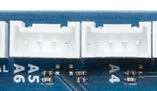
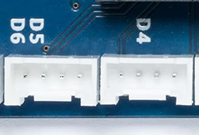
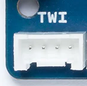

# マイコンインターフェース解説

マイコンとArduinoの概要でも簡単に紹介したが，Arduinoや多くのワンボードマイコンでは，ユーザが必要とする周辺回路は別途自分で配線する必要がある．

この時，利用できるインターフェースはアナログ端子，デジタル端子，I2C(Inter-Integrated Circuit)端子，SPI(Serial Peripheral Interface)端子である．

これらの端子を接続する回路に合わせて選択し，配線を行う必要がある．

最初に，それぞれのインターフェースがどのような性質のものであるかの概要を紹介する．

## 1. アナログ
アナログ端子は0からArduinoの動作電圧(3.3Vもしくは5V)の間の電圧を出力(もしくは入力)する端子である．

Arduinoからアナログ端子経由で電圧を出力する事例としては，LEDを接続し，明るさを制御するような用途が考えられる．

アナログ端子からArduinoに入力する事例としては，センサや測定機器が考えられる．
接続する機器が0から1000までの値をアナログ端子で出力する場合，出力された電圧と
Arduinoの電源電圧の比率を使って0から1000を表すような出力がされる．
プログラムを作る際には，これを考慮する必要がある．

もし，自分で周辺回路を作成する場合，Arduino側と接続するIC等の部品の両方の耐えられる最大の電圧や電流値を調べた上で，回路を設計する必要がある．

下の図は，Classicファミリ用Groveシールドの端子の割当を描いた図である．
アナログ関係のコネクタ「A0」から「A3」に着目すると，「A0コネクタ」のデータ線には
外側がA0端子，内側がA1端子が配線されており，それに続いて電源線とアース線が並んでいる．

このように，Seeed studioが販売しているGrove用シールドは各コネクタに2つづつデータ端子が対応付けられている．

[画像出典](https://www.switch-science.com/products/1293)

一方，Arduino公式で販売されているMKRファミリ用の基板では，基本1つのコネクタに接続されているデータ端子1つ(外側)のみで，データ用の内側の端子1つはどこにも配線されていない．ただし，「A5/A6」のみ1コネクタに2つのデータ線が配線されている．

## 2. デジタル
デジタル端子はアナログ端子と同じく，0からArduinoの動作電圧(3.3Vもしくは5V)の間の電圧を出力(もしくは入力)する端子である．

違いは，ある閾値を超えた電圧が端子に与えられた場合に1と判断し，そうでなければ0と判断される．そのため，1つの端子では0/1の値しか取り得ない．

また，アナログ端子と同様に，電圧，電流の最大値に注意する必要がある．

アナログ端子と同じく，下はClassicファミリ用Groveシールドの図である．各デジタル用のコネクタ「D2」から「D8」まで，1つのコネクタにデータ端子は2つづつ，それに加えてアースと電源端子の4個組となっている．

[画像出典](https://www.switch-science.com/products/1293)

Arduino公式で販売されているMKRファミリ用の基板では，基本1つのコネクタに接続されているデータ端子1つ(外側)のみで，デジタルの場合，「D5/D6」のみ1コネクタに2つのデータ線が配線されている．この構造はアナログ用コネクタと同じである．

## 3. I2C
I2C(Inter-Integrated Circuit)はフィリップス社(現NXP社)が提唱している通信インターフェースで，クロック信号線とデータ線が各1つ，それにアース(GND)と電源線の合計4つの端子を1組とする通信規格である．

I2Cでは，単純な0/1しか取り扱えないデジタル端子とは異なり，規格で定められた通信プロトコルを用いるため，I2Cをサポートした周辺回路(RTCやセンサなど)が持つ様々な機能を使うことができる．

I2Cの機能上と特徴として，1つのマスター機器に対して，多数のスレーブ機器を同じ配線上に接続することができ，マスターから，機器番号を使って，通信相手のスレーブ機器を指定して通信する方式となっている．

そのため，MCUに1組のI2C端子があれば，複数の周辺回路を接続することができることができるため，非常に使い勝手が良い．

ただし，I2CをサポートしているLSIなどの電子回路は1つのアドレスしか持たないものがほとんどであるため，1つの種類のLSIを複数接続しようとしても，それは不可能である．
一部の例外的なLSIは特定の端子にかかっている電圧により，2つ(場合によっては3つ)の中から，特定の番号をI2Cのアドレスとして動作するものがある．

この種のICの場合は，
配線を工夫することで同時に2つ(もしくは3つ)を接続できる．

下の図は，Classicファミリ用のGroveシールドの図であるが，I2Cのコネクタのところに，「SDA/A4」，「SCL/A5」と書かれている．「SDA」がデータ端子「SDL」がクロック信号端子であり，4つのI2CコネクタはArduinoの同じ端子に配線されている．

また，「A4」とか「A5」と書かれているのは，Arduino Unoの「A4」端子が設定次第で「アナログの4番端子」として使うか「I2Cのデータ端子」として使うかを選択することができるためである．ここで，Unoと限定しているのは，元々，classicシリーズと同じ形状(基板の形状やコネクタの配置)のものはUnoしかなかったためである．Uno以外はMCUの機種が異なるため，I2Cの端子がアナログの4番，5番として利用できるとは限らない．

[画像出典](https://www.switch-science.com/products/1293)

MKR用のgrove基板の場合，I2Cではなく，「TWI(Two Wired Interface)」と記載されており，I2Cの端子としてそのまま利用できるが，1つしかコネクタがないため，I2Cの周辺回路(機器)を複数取り付ける場合は，分岐のための回路を使う必要がある．

ただし，この分岐の回路([Grove I2C ハブ](https://jp.seeedstudio.com/Grove-I2C-Hub.html))はSeeed studioが販売しているため，それを購入すれば良い．

## 4. SPI
SPI (Serial Peripheral Interface)はクロックに同期させてデータの通信を行う同期式通信のひとつで，EEPROM(リードオンリーメモリの一種)やSDカードとの通信，イーサネットLSIとの通信に用いられる．詳細は[こちら](https://stupiddog.jp/note/archives/976)を参考にすること．

ここでは，簡単にArduinoの配線について紹介する．

下の図はSPI通信を行う機器の組み合わせ(配線)の事例である．通常，マスタはArduino等のマイコン，スレーブはSDカード等の機器となる．

図のSOUTは信号出力，SINが信号入力，SCLKはクロック信号端子，CSがチップセレクトである．
チップセレクトとは，マスターが特定のスレーブを呼び出すために利用する信号線で，チップセレクトに電圧がかかると，その配線に繋がっているスレーブはマスターからの通信内容に従い，何らかの仕事をして，SOUTからマスターに返事を返す．

ここで，SOUTとSINは別の呼び方もあり，MISO(Master In Slave Out)やMOSI(Master Out Slave In)という．これは，マスターとスレーブという役割に着目した呼び方である．

[画像出典](https://www.rohm.co.jp/electronics-basics/micon/mi_what8)

I2Cでは，データ線は1つしかなく，マスターとスレーブの間は交代してデータを送り合う仕組みであったが，SPIではデータ線は2本でマスターがデータを出力する配線と，スレーブがデータを出力する配線は別になっている．そのため，通信速度はI2Cより高くできる．

ただし，マスター側の機器はチップセレクトのための端子を接続する機器の数だけ用意する必要があるため，端子数が制限される環境では使いにくい．

また，GroveはSPIに対応していないため，SPIの機器は自分で配線をするか，Arduinoのシールドを購入(もしくは自作)する必要がある．ただし，イーサネットやマイクロSDはシールドがArduino公式から発売されているため，それを購入すれば自作する必要はない．

***
- [「利用するマイコン」に進む](BaseSystem.md)
- [「マイコンとArduinoの概要」に戻る](Arduino.md)
- [マニュアルトップに戻る](../Manual.md)
