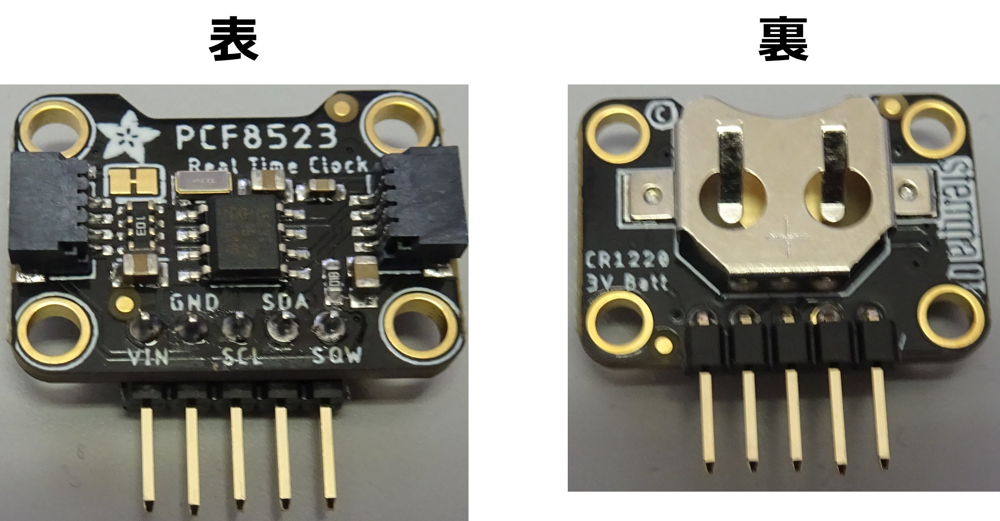
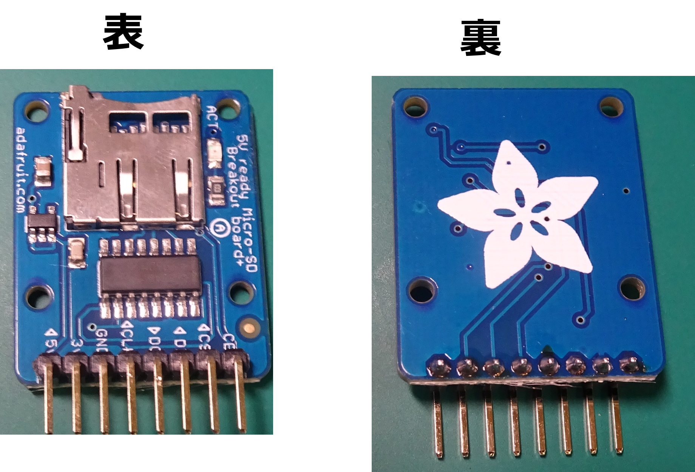
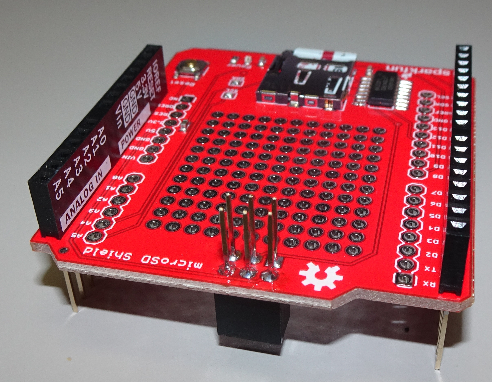

# はんだ付け
ここでは，用意した部材のうち，センサ以外ではんだ付けが必要なものの作業について説明する．

## 機種別のはんだ付けの要/不要

RTCは推奨品を使う場合，必ずピンのはんだ付けが必要であるが，それ以外の部品については，機種によってはんだ付けの必要性が異なる．
下の表は推奨品を使う場合のはんだ付けの必要性をまとめたものである．

|機種|RTC|マイクロSD|Groveシールド|
|---|---|---|---|
|MKRファミリ全て|要|－|－|
|Nanoファミリ全て|要|注1|要|
|イーサネットを用いないクラシックファミリ(Arduino Uno R4 WiFi等)|要|注2|－|
|イーサネット接続を行うClassicファミリ|要|－|－|

- 注1 : マイクロSDを利用する場合のみ必要
- 注2 : Seeed StudioのSDシールドではなく，SparkfunのマイクロSDのシールドを用いる場合ははんだ付けが必要

## RTC

RTCは推奨品のDS3231を利用することとするが， PCF8523 (NXP Semiconductors) https://www.adafruit.com/product/3295 , https://www.adafruit.com/product/5189でも同じである．

- Adafruit DS3231 Precision RTC Breakout

https://www.adafruit.com/product/3013

- ピンヘッダ　（オスＬ型）
https://akizukidenshi.com/catalog/g/gC-01627/

ピンヘッダは端子に名前が印字されているのとは反対側から差し込み，名前が印字されている側ではんだ付けを行う．

### ボタン電池
AdafruitのRTCモジュールは，基板裏側に電池ボックスが存在し，表面に「プラス(+)」の印がついている．
このプラスが見えている面にボタン電池の「+」の印字のある面を向けて挿入する．

## マイクロSDモジュール
NanoファミリでマイクロSDを利用する場合，シールドが利用できないため，下のSDモジュールをジャンパケーブルでArduinoに接続することになる．

https://www.adafruit.com/product/254

上記モジュールにはピンヘッダが添付されているが，直線上のものが添付されているため，これを利用すると配線が垂直になり
面倒なことが多いため，下のようなL型のピンヘッダを使うことを勧める．
- ピンヘッダ　（オスＬ型）
https://akizukidenshi.com/catalog/g/gC-01627/

RTCとは異なり，ピンヘッダは端子に名前が印字されているの表側から差し込み，裏側ではんだ付けを行う．

## Classicファミリ用マイクロSDシールド

Classic用には，SD(大きいもの)用のシールドとマイクロSDのシールド(部品の購入とはんだ付けが必要)の
いずれかが利用できる．

SDのものは，マイクロSDのメディアを直接挿せないが，はんだ付けが不要なところが利点である．
管理者の好みで選択すれば良い．

### SDカードのシールド
- SD Card Shield
https://www.seeedstudio.com/SD-Card-Shield-V4-p-1381.html

### マイクロSDのシールド
利用するものは以下の部材である．

- SparkFun microSD Shield
https://www.sparkfun.com/products/12761

- ピンソケット
https://www.adafruit.com/product/85
https://akizukidenshi.com/catalog/g/gC-17103/
https://akizukidenshi.com/catalog/g/gC-17102/

ピンソケットが重複しているのは，
[adafruitのピンソケット](https://www.adafruit.com/product/85)」に印字がなく，
今後の使い勝手を考えて，秋月電子で売っているArduino用のピンソケット([これ](https://akizukidenshi.com/catalog/g/gC-17103/)と[これ](https://akizukidenshi.com/catalog/g/gC-17102/))とSPIの端子以外は入れ替えた．

これらを下図のようにはんだ付けする．

## Nano用Groveシールド
下の写真を見てわかるように，Nano用のGroveシールドには，ジャンパケーブル等外部に配線を引き出すためのコネクタ等はGroveの
コネクタのみとなっている．

ただし，配線を引き出すためのピンソケットをはんだ付けするための穴は存在する．

- Grove Shield for Arduino Nano

https://www.seeedstudio.com/Grove-Shield-for-Arduino-Nano-p-4112.html

そのため，以下のピンソケットをはんだ付けする．

- ピンソケット

https://akizukidenshi.com/catalog/g/gC-10102/

ピンソケット2つをそれぞれ下図に従ってはめ込み，裏返す．

裏返した基板の2つの列に端子が出ているはずなので，そこをはんだ付けする．

はんだ付けしたものは以下のようになる．

***
- [「センサの手配」に戻る](Sensor_List.md)
- [マニュアルトップに戻る](../Manual.md)
