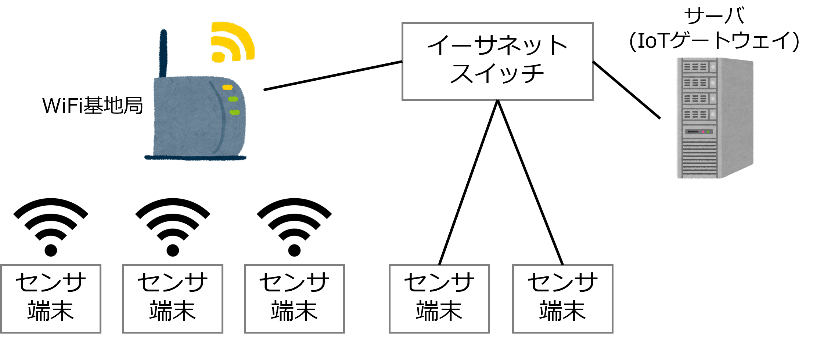

# 準備するセンサネットワーク

## ネットワーク構成
[本開発環境で想定するシステム](../Intro/IoT_Introduction.md)でも説明したように，本プロジェクトではTCP/IPのネットワーク上でMQTTプロトコルを利用したセンサ端末を運用する．
ネットワークとしては，WiFiもしくはイーサネット(場合によっては両方)でセンサ端末を接続するが，センサ端末にはセキュリティを担保するための機能を搭載する能力がないため，
専用のネットワークを用意する．さらに，その専用ネットワークにMQTTのサーバを設置する．

## IoTゲートウェイ用計算機
本プロジェクトの対象は，あくまで実験や学生の実習が主眼であるため，長期間ネットワーク機器やサーバを設置し続けられる環境ではない．
そのため，MQTTサーバ用の計算機も小型で運搬が容易な機器が望ましい．このため，ここからの解説では，[Raspberry Pi](https://www.raspberrypi.com/)を利用することを前提に説明を進める．

[Raspberry Pi](https://www.raspberrypi.com/)はイギリスの[Raspberry Pi 財団](https://www.raspberrypi.org/)によって開発されている小型のシングルボードコンピュータでLinuxで動作する(一部の機種を覗く)．
[Raspberry Pi 財団](https://www.raspberrypi.org/)は[Raspberry Pi](https://www.raspberrypi.com/)用のLinuxディストリビューション([Raspberry Pi OS](https://www.raspberrypi.com/software/))も開発している．

[Raspberry Pi](https://www.raspberrypi.com/)のハードウェアは，世代を重ねて現在バージョン5の出荷が開始されているが，4以降はCPU性能向上に伴い，発熱が多く，専用のケースや空冷のファンなどの装備が求められる
こと，ケースやACアダプタの入手が容易であることから，[Raspberry Pi 3 Model B](https://www.raspberrypi.com/products/raspberry-pi-3-model-b/)の利用を推奨する．

用意すべき機材は以下の3つ．
- Raspberry Pi
- Raspberry Pi用ケース
- マイクロSDカード(16G以上推奨)

もし，センサネットワークに接続するセンサ端末の台数が非常に多いとか，センサから非常に頻繁にデータが送信される，もしくは，センサデータにアクセスするアプリケーションサーバからのデータ取得要求が
多いなど，高い負荷が想定される場合は，Raspberry 4や5のうち，メモリ容量が多いものを購入し，専用のファンやヒートシンク，空冷を考慮した専用のケースなどの購入を検討していただきたい．

ハードウェアの入手や組み立て，[Raspberry Pi OS](https://www.raspberrypi.com/software/)のインストールについては，ネットワーク上に多数の参考文献が存在しているため，ここでは記述しない．

### ポータブルサーバとしての事例
通常，Raspberry Piは，HDMIディスプレイとUSBキーボード，マウスを要求するが，持ち歩く可能性がある場合はそれらの機器を無しで済ませることができれば，便利である．

Raspberry Piでは，Linuxのサーバ機のように，PCとサーバのシリアルポートを接続してインストールから，設定まで全て行うことができるため，Uart-USB変換ケーブルを購入することで，
インストールからシリアルで行うことができます．

- [参考文献](https://www.mikan-tech.net/entry/raspi-serial-console)

USB-uartケーブルを毎回Raspberry PiのGPIOピンに挿すのが面倒なので，USB-Uart変換基板を([これ](https://akizukidenshi.com/catalog/g/gM-08461/)とか[これ](https://akizukidenshi.com/catalog/g/gK-14652/))を
Raspberry Pi用基板([これ](https://www.switch-science.com/products/1905)とか[これ](https://shop.sunhayato.co.jp/products/ub-rpi02))にはんだ付けしたHATを作成して運用しています．

## MQTTブローカー用ソフトウェア
センサネットワーク上に設置するIoTゲートウェイでは，MQTTのサーバ(MQTTではブローカーと呼ぶ)を動作させ，センサ端末からデータを収集するが，
Linuxで動作するユーザ数が多いMQTTブローカーとして[Mosquitto](https://mosquitto.org/)がある．

Raspberry Pi OSへのインストールとセットアップ，動作確認のためのテストについては，以下の2つの参考文献に詳しく解説されているため，こちらを
読んで作業を行っていただきたい．

- [参考文献1](https://hagane-karakuriya.com/2022/07/22/%E3%80%90%E5%82%99%E5%BF%98%E9%8C%B2%E3%80%91raspberry-pi-%E3%81%AB-mosquitto-mqtt-broker%E3%82%92%E3%82%A4%E3%83%B3%E3%82%B9%E3%83%88%E3%83%BC%E3%83%AB/)
- [参考文献2](https://developer.mamezou-tech.com/iot/internet-of-things-06/)

***

- [マニュアルトップに戻る](../Manual.md)
