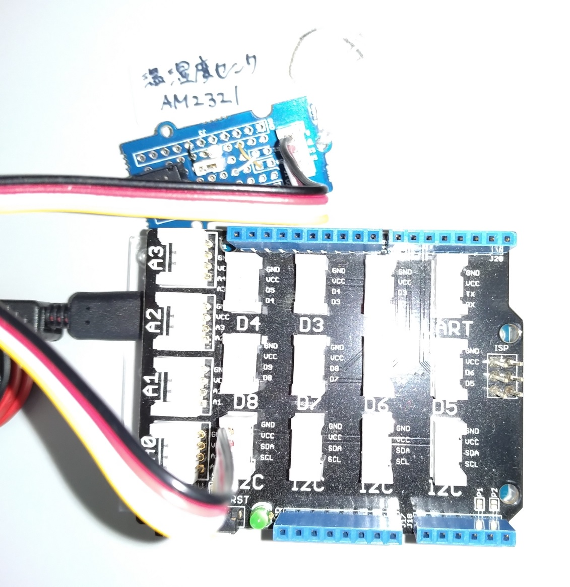

# AM232Xシリーズ温湿度計

AM232XはI2Cの通信プロトコル，もしくは，独自のデジタル端子を使った通信プロトコルで測定データを取得する，温湿度センサである．

このシリーズのセンサチップを利用した代表的なセンサ製品には以下のようなものがある．

- AM2322 : https://akizukidenshi.com/catalog/g/gM-10880/

AM232Xシリーズのセンサは，独自プロトコルとI2Cの両方をサポートしているが，本ソフトウェアの環境では，I2Cでの接続のみをサポートしている．

チップ販売元のデータシートはネットでは見つけられなかったが，秋月電子が公開しているので，それをまとめたものが以下の表である．

|機種|電源電圧|データシート|
|---|---|---|
|AM2321|2.6-5.5V|https://akizukidenshi.com/download/ds/aosong/AM2321_e.pdf|
|AM2322|3.1-5.5V|https://akizukidenshi.com/download/ds/aosong/AM2322_V1.0.pdf|

両方とも，3.3V,5V系のArduinoで動作するはずである．

## Arduinoとの接続例

下の写真は，AM2321をGroveのケーブルでI2C接続できるように加工した基板である．上のデータシートに記載があるように，下の写真のショートピンはI2C接続と，独自プロトコルの切り替えを行うための配線となっており，下の写真の状態で，I2C接続となる．

このモジュールはI2C接続となるため，MKRシリーズ用のGrove基板の場合は，「TWI」コネクタと接続する．

- MKRシリーズ用Grove基板 https://store-usa.arduino.cc/products/arduino-mkr-connector-carrier-grove-compatible?selectedStore=us

Uno等のクラシックシリーズ用のGrove基板の場合は，下の写真にも見えているように，「I2C」端子に接続する．
- Unoシリーズ用Grove基板  https://jp.seeedstudio.com/Base-Shield-V2.html 

以下の例はクラシックシリーズ用のGrove基板を利用した事例である．

もし，独自の方法で接続する場合は，データシートを参照して実施すること．

## 接続先の情報

I2Cで接続する機器はピンに関する情報をメモしておく必要はないが，AM232xシリーズのセンサ(AM2321 , AM2322)のうち，どのセンサを
使うかはメモしておくこと．

***

- [「センサ端末の詳細定義」に戻る](../SensorSelection.md)

