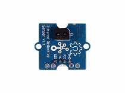

# GROVE - 赤外線反射センサ

1つのデジタル端子を使い，紙や地面に描いた黒線を検出するような目的で用いる．

- Grove - Infrared Reflective Sensor https://wiki.seeedstudio.com/Grove-Infrared_Reflective_Sensor/

このモジュールは3.3V, 5V両用である．

下の写真はこのモジュールの基板部分の拡大であるが，赤外線のLEDと赤外線センサを組み合わせて，
LEDが発した赤外線を地面等で反射したものが赤外線センサで検知できるか否かでセンサの出力が変化する．

そのため，黒い地面などでは赤外線が検出できなくなることを利用して，判定を行う．

[写真出典](https://wiki.seeedstudio.com/Grove-Infrared_Reflective_Sensor/)

Groveには似た機能のモジュールが存在するが，検出対称である地面や机までの距離が
異なるなどの性質の違いがあるため，それによって使い分ける．

なお，このセンサは4-15mmの範囲に検出対称が存在する場合に用いる．

## Arduinoとの接続例
デジタル端子1つに接続する必要があるため，Groveの端子に接続できるモジュールを用いる場合は，ケーブル1本で何れかのデジタル端子に接続すれば良い．

下の図はArduino MKRシリーズ用のGroveモジュールを接続するための拡張基板であり，D0からD4のうちのいずれかに接続する．

[写真出典](https://store-usa.arduino.cc/products/arduino-mkr-connector-carrier-grove-compatible)

## 接続先の情報

スイッチをどのピン(D0,D1など)に接続したかをメモしておく．

***

- [「センサ端末の詳細定義」に戻る](../SensorSelection.md)
