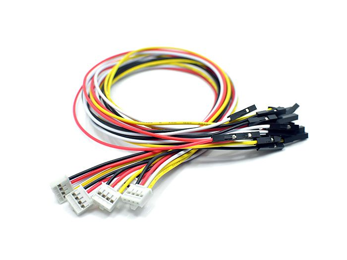

# HTS221

STマイクロ社の[HTS221](https://www.st.com/ja/mems-and-sensors/hts221.html)という温湿度センサICで，インターフェースとしては，I2CとSPIの両方を利用可能．ただし，本開発環境では，I2Cのみをサポートしている．

このセンサICを利用したセンサモジュールとしては，以下のようなものがある．

- Adafruit  https://www.adafruit.com/product/4535
- Arduino MKR ENV Shield rev2 https://store.arduino.cc/products/arduino-mkr-env-shield-rev2

なお，動作電圧は1.7Vから3.6Vであるため，5Vで動作するArduino Uno等では使えません．

## Arduinoとの接続例
上記，Adafruitのモジュールをarduinoに接続する場合，groveの基板と以下のケーブルを用いて接続するのが一番容易である．

- https://jp.seeedstudio.com/Grove-4-pin-Female-Jumper-to-Grove-4-pin-Conversion-Cable-5-PCs-per-PAck.html?queryID=e8c3de5285fc84978b0660186520d221&objectID=2221&indexName=bazaar_jp_products

Grove用のケーブルの配線接続は以下の通り．
|ケーブルの色|接続先端子|
|---|---|
|黄|SCL|
|白|SDA|
|黒|GND|
|赤|VIN|

このモジュールはI2C接続となるため，MKRシリーズ用のGrove基板の場合は，「TWI」コネクタと接続する．

- MKRシリーズ用Grove基板 https://store-usa.arduino.cc/products/arduino-mkr-connector-carrier-grove-compatible?selectedStore=us

Uno等のクラシックシリーズ用のGrove基板の場合は，下の写真にも見えているように，「I2C」端子に接続する．
- Unoシリーズ用Grove基板  https://jp.seeedstudio.com/Base-Shield-V2.html 

Arduino MKR ENV Shieldは通常のシールドと同じく，積み重ねれば良い．

## 接続先の情報

I2Cで接続する機器は特に情報をメモしておく必要はない．

***

- [「センサ端末の詳細定義」に戻る](../SensorSelection.md)